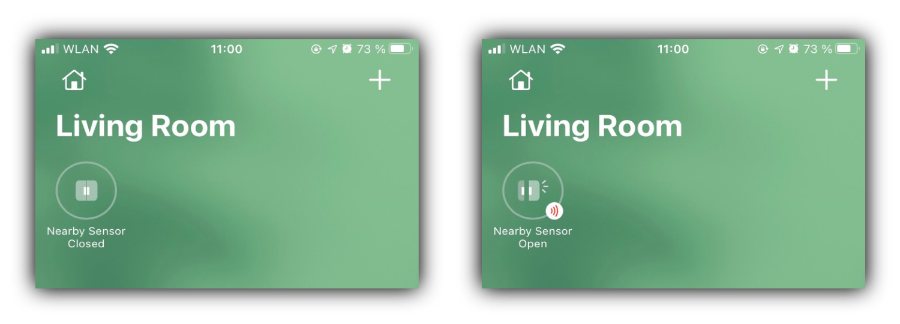
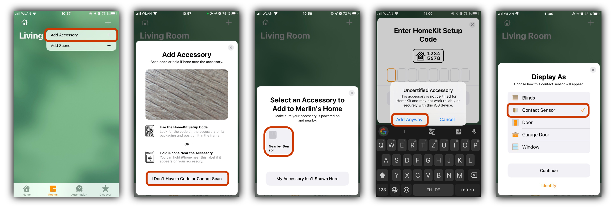

# Nearby-Sensor

This is a *virtual HomeKit sensor* that triggers when Apple devices are nearby. It listens for Bluetooth-LE advertisements and checks if the received signal strength is above a threshold.

Built with [HomeControl](https://github.com/brutella/hc) and [go-ble](https://github.com/go-ble/ble).



It does NOT identify *your* smartphones (like the real 'Nearby' feature does). It doesn't do anything smart at all, basically. It's a 3 hour project and seems to work, kind of, so here it is.

## Requirements

* Ubuntu (tested Raspberry Pi with Ubuntu Server 20.04)
* [Go installation](http://golang.org/doc/install)
* Bluetooth

## Build

- `git clone https://github.com/mrlnc/nearby-sensor`
- `go get`
- `go build nearby-sensor.go`

Allow the binary `nearby-sensor` to access Bluetooth devices without root permissions:
```
sudo setcap 'cap_net_raw,cap_net_admin+eip' nearby-sensor
```

## Run

```
Usage of ./nearby-sensor:
  -dev string
        Bluetooth Device (default "hci0")
  -pin string
        HomeKit 8-digit PIN for this accessory (default "32191123")
  -threshold string
        Filter beacons below this threshold, in dBm (default "-50")
  -timeout string
        Switch-off delay, in seconds (default "5")
```

You can configure the activation distance through the threshold.
The timeout will keep the sensor active for a couple of seconds after the last beacon was seen.

For example:
```
./nearby-sensor -pin 12312312 -threshold -45 -timeout 10
```

Running the sensor will initialize a new directory 'Nearby Sensor'. If you delete that folder, you need to pair the sensor again with Homekit.

## Add to Home



# Activation Distance

The sensor records Bluetooth advertisements and triggers if the received signal strength (the RSSI) is above the threshold. This step is a lot trial & error because it depends on your receiver.

On the Raspberry Pi 4, I use these thresholds:
* `-45` is about 20 cm
* `-50` is about a meter

Start there, adjust the threshold and see if it triggers :)

# systemd-unit

Adjust the paths and the username and move the unit to `/etc/systemd/system/nearby-sensor.service`
```
[Unit]
Description=Nearby sensor for Homekit

[Service]
Type=simple
User=merlin
WorkingDirectory=/home/merlin/nearby-sensor
ExecStart=/home/merlin/nearby-sensor/nearby-sensor

[Install]
WantedBy=multi-user.target
```

Reload the daemon and enable the service:
```
sudo systemctl daemon-reload
sudo systemctl enable nearby-sensor
sudo systemctl start nearby-sensor
```

The logs are visible in `journalctl`.

# Credits & License

The project is build with:
* `go-ble` by Currant Inc. (BSD 3-Clause "New" or "Revised" License, [see here](https://github.com/go-ble/ble/blob/master/LICENSE))
* HomeControl/`hc` by Matthias Hochgatterer (Apache License 2.0, [see here](https://github.com/brutella/hc/blob/master/LICENSE))
* idea from [hexway/BLEEE](https://github.com/hexway/apple_bleee). they go much further in device identification, have a look at [their paper](https://arxiv.org/pdf/1904.10600.pdf)

Trademarks by Apple & Bluetooth, probably. This is of course no official HomeKit equipment. Don't expect it to work.
